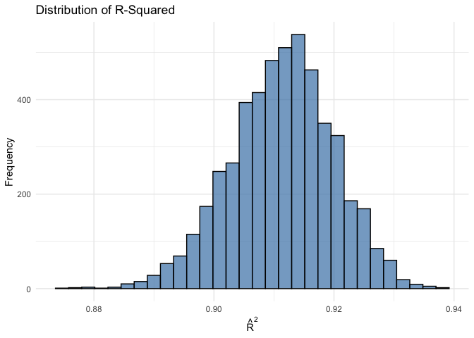
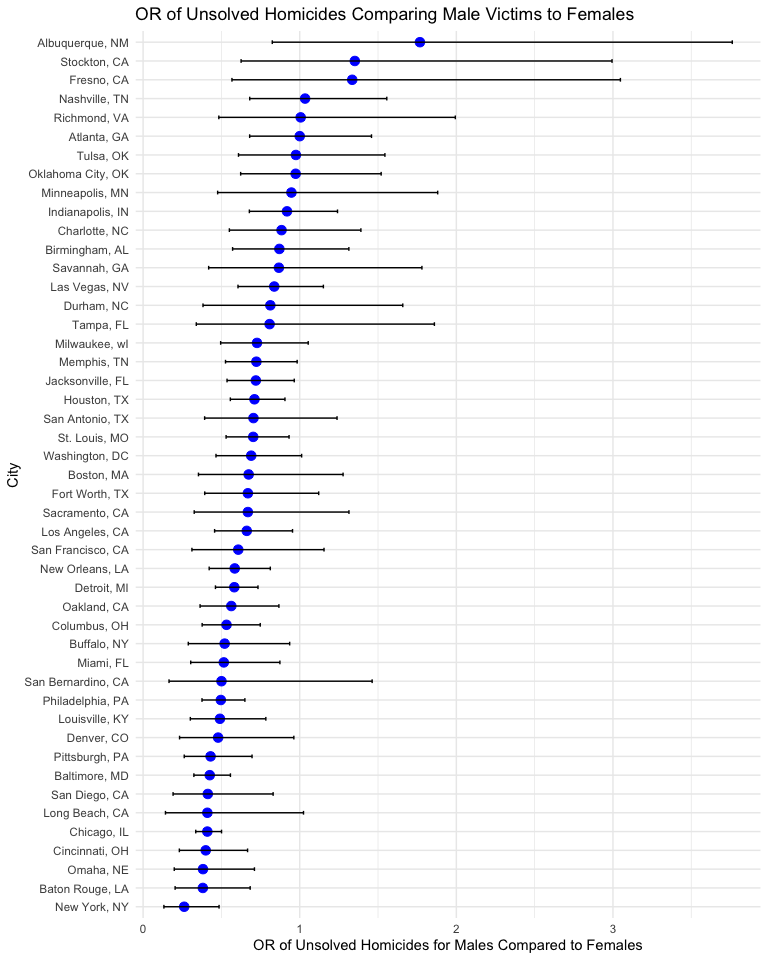
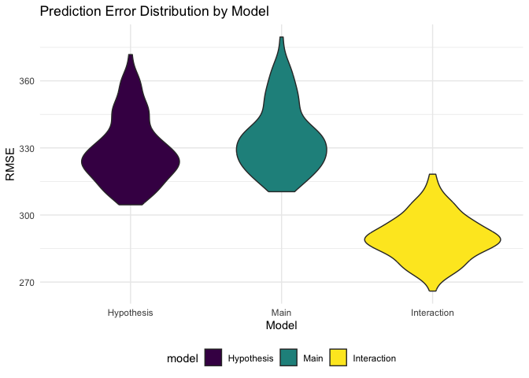

Homework 6
================
Laura Bulmer
12/2/2024

## Problem 1

``` r
# Loading data.

weather_df = 
  rnoaa::meteo_pull_monitors(
    c("USW00094728"),
    var = c("PRCP", "TMIN", "TMAX"), 
    date_min = "2017-01-01",
    date_max = "2017-12-31") %>%
  mutate(
    name = recode(id, USW00094728 = "CentralPark_NY"),
    tmin = tmin / 10,
    tmax = tmax / 10) %>%
  select(name, id, everything())
```

``` r
# Producing the estimates.

bootstrap_results <- 
  replicate(5000, {
    boot_sample <- weather_df %>% sample_frac(replace = TRUE)
    model <- lm(tmax ~ tmin, data = boot_sample)
    coefs <- coef(model)
    beta0 <- coefs[1]
    beta1 <- coefs[2]
    r_squared <- summary(model)$r.squared
    log_beta_product <- log(beta0 * beta1)
    c(r_squared, log_beta_product)
  }, simplify = "matrix") %>%
  t() %>%
  as.data.frame()

colnames(bootstrap_results) <- c("r_squared", "log_beta_product")

bootstrap_summary <- bootstrap_results %>%
  summarise(
    mean_r_squared = mean(r_squared),
    sd_r_squared = sd(r_squared),
    mean_log_beta_product = mean(log_beta_product),
    sd_log_beta_product = sd(log_beta_product)
  )

print(bootstrap_summary)
```

    ##   mean_r_squared sd_r_squared mean_log_beta_product sd_log_beta_product
    ## 1      0.9113306  0.008575295              2.013103          0.02393153

``` r
# Plotting distribution of R-squared

bootstrap_results %>%
  ggplot(aes(x = r_squared)) +
  geom_histogram(bins = 30, fill = "steelblue", color = "black", alpha = 0.7) +
  labs(
    title = "Distribution of R-Squared",
    x = expression(hat(R)^2),
    y = "Frequency"
  ) +
  theme_minimal()
```

<!-- -->

``` r
# Plotting distribution of log(beta0 * beta1)

bootstrap_results %>%
  ggplot(aes(x = log_beta_product)) +
  geom_histogram(bins = 30, fill = "coral", color = "black", alpha = 0.7) +
  labs(
    title = "Distribution of log(β₀ * β₁)",
    x = expression(log(beta[0] * beta[1])),
    y = "Frequency"
  ) +
  theme_minimal()
```

<!-- -->

The distribution of both R-squared and log(beta0 \* beta1) appear to be
relatively normal. The mean estimate of R-squared is .911 with an SD of
.009 and the mean estimate of log(beta0 \* beta1) is 2.013 with an SD of
.024.

``` r
# Getting confidence intervals

ci_results <- bootstrap_results %>%
  summarise(
    r_squared_lower = quantile(r_squared, 0.025),
    r_squared_upper = quantile(r_squared, 0.975),
    log_beta_product_lower = quantile(log_beta_product, 0.025),
    log_beta_product_upper = quantile(log_beta_product, 0.975)
  ) %>% print()
```

    ##   r_squared_lower r_squared_upper log_beta_product_lower log_beta_product_upper
    ## 1       0.8936684        0.927106               1.964949               2.058887

## Problem 2

``` r
# Loading in the data. 

homicides_raw= 
  read_csv("data/homicide-data.csv",show_col_types = FALSE)

# Creating a city_state variable and solved binary variable, and filtering.

homicides_df <- 
  homicides_raw %>%
  mutate(
    city_state = paste(city, state, sep = ", "),
    solved = case_when(
      disposition %in% c("Open/No arrest", "Closed without arrest") ~ 0,
      disposition == "Closed by arrest" ~ 1,
      TRUE ~ NA_real_
    ),
    victim_age = as.numeric(victim_age)
  )%>%
  filter(
    !city_state %in% c("Dallas, TX", "Phoenix, AZ", "Kansas City, MO", 
                       "Tulsa, AL"),
    victim_race %in% c("White", "Black")
    )
```

``` r
# Fitting the logistic regression model for Baltimore, MD.

baltimore = glm(
  solved ~ victim_age + victim_sex + victim_race,
  data = homicides_df %>% filter(city_state == "Baltimore, MD"),
  family = binomial()
) %>%
  broom::tidy(conf.int=TRUE) 

baltimore
```

    ## # A tibble: 4 × 7
    ##   term             estimate std.error statistic  p.value conf.low conf.high
    ##   <chr>               <dbl>     <dbl>     <dbl>    <dbl>    <dbl>     <dbl>
    ## 1 (Intercept)       0.310     0.171        1.81 7.04e- 2  -0.0245  0.648   
    ## 2 victim_age       -0.00673   0.00332     -2.02 4.30e- 2  -0.0133 -0.000246
    ## 3 victim_sexMale   -0.854     0.138       -6.18 6.26e-10  -1.13   -0.584   
    ## 4 victim_raceWhite  0.842     0.175        4.82 1.45e- 6   0.501   1.19

``` r
# Estimate and CI of adjusted OR for solving homicides comparing genders

victim_sex_odds_ratio = baltimore %>%
  filter(term == "victim_sexMale") %>%
  mutate(
    odds_ratio = exp(estimate),
    conf_low = exp(conf.low),
    conf_high = exp(conf.high)
  ) %>%
  select(term, odds_ratio, conf_low, conf_high) %>%
  knitr::kable(digits=3)

victim_sex_odds_ratio
```

| term           | odds_ratio | conf_low | conf_high |
|:---------------|-----------:|---------:|----------:|
| victim_sexMale |      0.426 |    0.324 |     0.558 |

The OR for solving homicides comparing men to women in Baltimore, MD is
.426 with a CI of .324, .558.

``` r
# Creating tidy pipeline to do the same for all cities.

all_city_results = homicides_df %>%
  group_by(city_state) %>%
  nest() %>%
  mutate(
    model = map(data, ~glm(
      solved ~ victim_age + victim_sex + victim_race,
      data = .x, 
      family = binomial)
    ),
    results = map(model, ~ broom::tidy(.x, conf.int=TRUE))
    ) %>%
  unnest(cols = c(results)) %>%
  filter(term == "victim_sexMale") %>%
  mutate(
    odds_ratio = exp(estimate),
    conf_low = exp(conf.low),
    conf_high = exp(conf.high)
  ) %>%
  select(term, odds_ratio, conf_low, conf_high)

all_city_results
```

    ## # A tibble: 47 × 5
    ## # Groups:   city_state [47]
    ##    city_state      term           odds_ratio conf_low conf_high
    ##    <chr>           <chr>               <dbl>    <dbl>     <dbl>
    ##  1 Albuquerque, NM victim_sexMale      1.77     0.825     3.76 
    ##  2 Atlanta, GA     victim_sexMale      1.00     0.680     1.46 
    ##  3 Baltimore, MD   victim_sexMale      0.426    0.324     0.558
    ##  4 Baton Rouge, LA victim_sexMale      0.381    0.204     0.684
    ##  5 Birmingham, AL  victim_sexMale      0.870    0.571     1.31 
    ##  6 Boston, MA      victim_sexMale      0.674    0.353     1.28 
    ##  7 Buffalo, NY     victim_sexMale      0.521    0.288     0.936
    ##  8 Charlotte, NC   victim_sexMale      0.884    0.551     1.39 
    ##  9 Chicago, IL     victim_sexMale      0.410    0.336     0.501
    ## 10 Cincinnati, OH  victim_sexMale      0.400    0.231     0.667
    ## # ℹ 37 more rows

``` r
# Plotting the ORs and CIs

all_city_results%>%
  mutate(city_state = factor(city_state, levels = city_state)) %>%
  ggplot(aes(x = reorder(city_state, odds_ratio), y = odds_ratio)) +
  geom_point(color = "blue", size = 3) +
  geom_errorbar(aes(ymin = conf_low, ymax = conf_high), width = 0.2) +
  coord_flip() + 
  labs(
    title = "OR of Unsolved Homicides Comparing Male Victims to Females",
    x = "City",
    y = "OR of Unsolved Homicides for Males Compared to Females"
  )
```

<!-- -->

This plot gives us the OR and confidence intervals for solving homicides
comparing male victims to female victims in cities throughout the US.
Those with ORs higher than 1 indicate a higher odds of male homicides
being solved compared to female. However, more of the cities reflect ORs
lower than 1, indicating homicides are more likely to be solved for
female victims. The highest OR is for Albuquerque, NM, which may be due
to several things included a lower number of observations comparative to
other cities.

## Problem 3

``` r
# Loading the birthweight data.

bwt_raw= 
  read_csv("data/birthweight.csv", show_col_types = FALSE)

# Checking for missing values.

bwt_raw %>%
  summarise(across(everything(), ~sum(is.na(.))))
```

    ## # A tibble: 1 × 20
    ##   babysex bhead blength   bwt delwt fincome frace gaweeks malform menarche
    ##     <int> <int>   <int> <int> <int>   <int> <int>   <int>   <int>    <int>
    ## 1       0     0       0     0     0       0     0       0       0        0
    ## # ℹ 10 more variables: mheight <int>, momage <int>, mrace <int>, parity <int>,
    ## #   pnumlbw <int>, pnumsga <int>, ppbmi <int>, ppwt <int>, smoken <int>,
    ## #   wtgain <int>

``` r
# Converting variables to factors where appropriate.

bwt_df = 
  bwt_raw %>%
  mutate(
    babysex = as.factor(babysex),
    frace = as.factor(frace),
    malform = as.factor(malform),
    mrace = as.factor(mrace)
  )
```

First, we are selecting a hypothesized model.

The process used to select a model was based on hypothesizing factors
that underly birthweight. To do so, I reflected upon previous
discussions, assigned readings and studies, and models that were part of
the Mailman curriculum. The hypothesized model for birthweight includes
blength, gaweeks, mheight, and wtgain as indicators.

``` r
# Creating the hypothesized model.

hyp_mod = lm(bwt ~ blength + gaweeks + mheight + wtgain, data = bwt_df)

# Plotting model residuals against fitted values.

bwt_df %>%
  add_predictions(hyp_mod) %>%
  add_residuals(hyp_mod) %>%
  ggplot(aes(x = pred, y = resid))+
  geom_point(alpha = .2)+
  geom_smooth(method = "lm")+
  labs(
    x = "Fitted Values",
    y = "Residuals",
    title = "Hypothesized Model: Residuals vs Fitted Values"
  )
```

    ## `geom_smooth()` using formula = 'y ~ x'

<!-- -->

Next we will compare the hypothesized model against two pre-set models.

``` r
# Creating splits

cv_df =
  crossv_mc(bwt_df, 100) %>%
  mutate(
    train = map(train, as_tibble),
    test = map(test, as_tibble))

# Fitting models to training data and obtain corresponding RMSEs for the testing data.

cv_df = 
  cv_df |> 
  mutate(
    hyp_mod     = map(train, \(df) lm(bwt ~ blength + gaweeks + mheight + wtgain, data = df)),
    alt_mod1    = map(train, \(df) lm(bwt ~ blength + gaweeks, data = df)),
    alt_mod2    = map(train, \(df) lm(bwt ~ bhead + blength + babysex + blength * bhead * babysex, data = df))) |> 
  mutate(
    rmse_hyp    = map2_dbl(hyp_mod, test, rmse),
    rmse_alt1   = map2_dbl(alt_mod1, test, rmse),
    rmse_alt2   = map2_dbl(alt_mod2, test, rmse))
```

``` r
# Plotting the prediction error distribution for each model.

cv_df |> 
  select(starts_with("rmse")) |> 
  pivot_longer(
    everything(),
    names_to = "model", 
    values_to = "rmse",
    names_prefix = "rmse_") |> 
  mutate(model = fct_inorder(model),
         model = recode(model, 
                   "hyp" = "Hypothesis", 
                   "alt1" = "Main", 
                   "alt2" = "Interaction")) |> 
  ggplot(aes(x = model, y = rmse, fill = model)) + geom_violin()+
    labs(x = "Model", y = "RMSE", title = "Prediction Error Distribution by Model")
```

<!-- -->

From the graph above, it appears that the interaction model showed the
best prediction accuracy when compared to the interaction model and the
hypothesized model. The hypothesized model performed just slightly
better than the main simple model that solely included length at birth
and gestational age as indicators.
